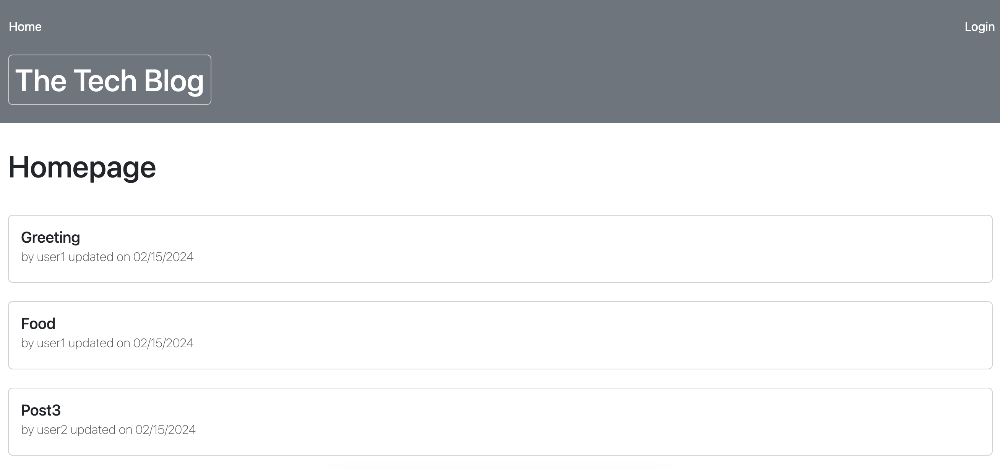

# Tech-Blog-MVC

[Deployed App link](https://salida-tech-blog-mvc-3985272c2511.herokuapp.com/)

[GitHub Repo Link](https://github.com/salidamaharjan/tech-blog-MVC)

## Description
* This project is completed to create a Tech-Blog Post.
* The landing page looks as follow:

* The user are required to login in order to create post, add comment on the post, to delete or update their post.
* If not logged in then the user can only view the posts.

## Table of Content
1. [Installation](#installation)
2. [Run](#run)
3. [Deploy](#deploy)
4. [Usage](#usage)
5. [Credits](#credits)
6. [License](#license)
7. [Contact](#contact)

## Installation
* Use `npm install` to install all the packages and dependencies.

## Run
* Run `npm run seed` to seed the database.
* Run `npm run start` to start the application.

## Deploy
* To deploy create heroku app using `heroku create app-name` command.
* Use this `heroku addons:create cleardb:punch8` to create mysql in heroku.
    * [Clear DB mysql on heroku](https://devcenter.heroku.com/articles/cleardb#the-cleardb-shared-mysql-complete-tutorial)
    * [Clear DB information](https://elements.heroku.com/addons/cleardb#pricing)
* Use this `heroku config | grep CLEARDB_DATABASE_URL` to get database connection url.
* Copy the url and set .env variable.
* Use `npm run seed` to create table and seed the database.
* Set config variable in heroku for `SESSION_SECRET`.
* Use `git push heroku` to deploy application.

## Usage
* Go to the deployed app link provided above and use the application.

## Credits
* Boot camp course, class activities
* [Sequelize Documentation](https://sequelize.org/docs/v6/getting-started/)
* [Handlebars.js](https://handlebarsjs.com/guide/#installation)
* [Express.js](https://expressjs.com/en/starter/basic-routing.html)
* [Session Storage](https://expressjs.com/en/resources/middleware/session.html)
* [Dayjs](https://github.com/iamkun/dayjs)
* [Clear DB mysql on heroku](https://devcenter.heroku.com/articles/cleardb#the-cleardb-shared-mysql-complete-tutorial)
* [Clear DB information](https://elements.heroku.com/addons/cleardb#pricing)

## License

A short, permissive software license. Basically, you can do whatever you want as long as you include the original copyright and license notice in any copy of the software/source. There are many variations of this license in use.

## Contact
Should you have any question, you can reach me at:

[GitHub](https://github.com/salidamaharjan)

[Email Me](mailto:email@email.com)